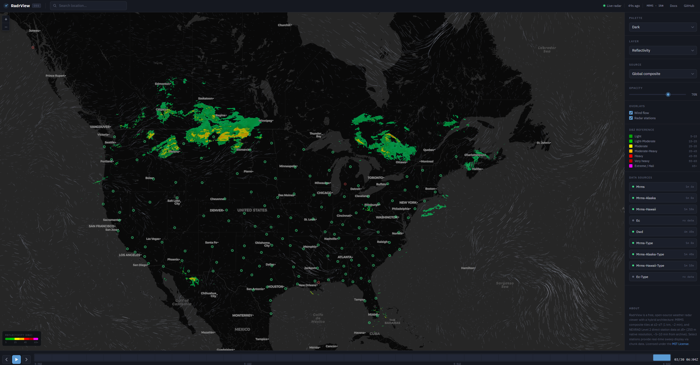

# RadrView

Self-hosted, real-time weather radar with direct NEXRAD Level 2 station access. No API keys. No vendor lock-in.

**[Live Demo](https://radrview.com)** | **[Documentation](docs/README.md)** | **[Donate](https://donate.stripe.com/3cI3cv9Vpew2fhf1AUcfK00)**



## What it does

- **Hybrid radar architecture** — MRMS composite at z2-z7 (1km), NEXRAD Level 2 at z8+ (250m native resolution)
- **159 NEXRAD stations** — direct from NOAA's WSR-88D network, ~5-10 minute updates
- **Real-time sweep display** — watch the radar beam rotate for stations with live chunk data
- **Global wind flow** — GFS model particle visualization, like Windy.com
- **Biological layer** — birds, insects, bats detected via dual-pol correlation coefficient
- **Velocity layer** — Doppler radial wind speed from Level 2 data
- **Multi-source composites** — MRMS (US), Environment Canada, DWD (Germany)
- **6 color palettes** — Dark, NOAA, Viridis, Grayscale, Biological, Velocity
- **WebSocket push** — real-time frame notifications and sweep wedge streaming
- **Precipitation type** — rain, snow, freezing rain, hail classification
- **24-hour animation** — crossfade transitions with playback controls

## Quick Start

```bash
git clone https://github.com/cwdaniel/radrview.git
cd RadrView
docker compose -f docker/docker-compose.yml up -d
```

Open **https://radrview.com** (or `http://localhost:8600` for local dev) — radar data appears within 60 seconds. NEXRAD Level 2 data loads within 5 minutes.

## Architecture

```
z2-z7 (macro)                    z8+ (close-up)
MRMS Composite                   NEXRAD Level 2
1km resolution                   250m resolution
Ingest → Tile → MBTiles          Archive → Parse → Project → Render on demand
                    ↘                        ↙
                      Express Server (:8600)
                      Tile endpoint + WebSocket
                      Wind flow from GFS
```

## API

```
GET /tile/:timestamp/:z/:x/:y?palette=dark&source=composite&layer=reflectivity
GET /frames/latest?source=composite
GET /nexrad/stations
GET /wind/grid
GET /health
WS  /ws → { type: "new-frame" | "sweep-wedge" }
```

Full API docs: [docs/api.md](docs/api.md)

## Documentation

- [Getting Started](docs/getting-started.md) — prerequisites, first run
- [Architecture](docs/architecture.md) — pipeline, NEXRAD, wind
- [Configuration](docs/configuration.md) — environment variables
- [API Reference](docs/api.md) — endpoints, WebSocket, tile URL format
- [Sources](docs/sources.md) — MRMS, EC, DWD, NEXRAD Level 2, GFS
- [Palettes](docs/palettes.md) — color palettes and custom palette guide
- [Adding a Source](docs/adding-a-source.md) — step-by-step for new radar feeds
- [Deployment](docs/deployment.md) — production setup
- [Gotchas](docs/gotchas.md) — known issues

## Contributing

See [CONTRIBUTING.md](CONTRIBUTING.md) for guidelines on bug reports, feature requests, and pull requests.

## Support

If RadrView is useful to you, consider [making a donation](https://donate.stripe.com/3cI3cv9Vpew2fhf1AUcfK00).

## License

MIT — see [LICENSE](LICENSE)
