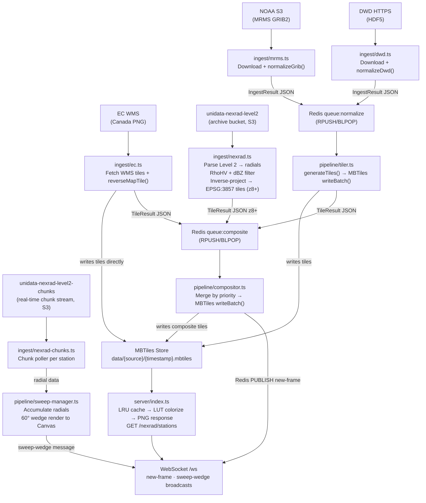

# Architecture

RadrView is a pipeline of discrete workers connected through Redis queues and a shared MBTiles tile store. Each stage can run in a separate Docker container (or multiple containers for the tiler).

## Hybrid Zoom Architecture

RadrView serves two different data paths depending on the client's zoom level:

| Zoom | Data source | Resolution | Update cadence |
|---|---|---|---|
| z2–z7 | MRMS composite tiles | ~1 km | ~2 min |
| z8+ | NEXRAD Level 2 (WSR-88D) | 250 m native | ~5–10 min (archive); real-time sweep for stations with chunk data |

At z8+, tiles are generated from individual NEXRAD Level 2 volume scans projected to EPSG:3857. The GPU upscaler is no longer part of the stack — native 250 m NEXRAD data provides sufficient detail at high zoom levels without upscaling.

## Full Pipeline



## Grayscale Byte Encoding

All internal tile data uses a single-channel grayscale PNG where each byte encodes a dBZ value:

**Encode (dBZ to pixel):**
```
pixel = ((dBZ + 10) / 90) * 254 + 1
```

**Decode (pixel to dBZ):**
```
dBZ = ((pixel - 1) / 254) * 90 - 10
```

**Special values:**
- Pixel `0` = NoData (transparent in all palettes)
- Pixel `1` = -10 dBZ (minimum detectable signal)
- Pixel `255` = 80 dBZ (extreme hail/tornado)

This encoding maps the meteorologically relevant range of -10 to 80 dBZ into byte values 1-255 with approximately 0.35 dBZ precision per step. NoData is kept at 0 so zero-byte tiles need no special handling.

**Precipitation type tiles** use a different convention: pixel values are raw MRMS `PrecipFlag` integer codes (0 = NoData, 1 = Rain, 2 = Snow, 3 = Cool Rain, 4 = Convective, 5 = Tropical/Monsoon, 6 = Freezing Rain, 7 = Hail, 10 = Snow Above Melting Layer, 91 = Tropical Stratiform, 96 = Snow Cool Season). These are not dBZ values and are stored in separate `-type` sources.

## Ingester Patterns

### Pattern 1: GRIB2/HDF5 (MRMS, DWD)

1. Download compressed raw file (GRIB2.gz or HDF5)
2. Decompress to `data/raw/{source}/{timestamp}.grib2`
3. `normalizeGrib()` or `normalizeDwd()`:
   - `gdalwarp`: reproject from native CRS → EPSG:3857, set NoData
   - `gdal_translate`: quantize float dBZ → byte [1-255], NoData=0
4. Write GeoTIFF to `data/normalized/{source}/{timestamp}.tif`
5. Push `IngestResult` JSON to `queue:normalize`
6. Delete raw and normalized files after tiling

### Pattern 2: WMS Tiles (EC Canada)

1. Fetch available timestamps from WMS `GetCapabilities`
2. For each zoom level, fetch 256x256 PNG tiles from WMS
3. `reverseMapTile()`: convert pre-colored RGB pixels back to dBZ byte values using hardcoded color table + RGB distance threshold
4. Write grayscale tiles directly to MBTiles via `TileStore.writeBatch()`
5. Push `TileResult` directly to `queue:composite` (skips the tiler)

## Normalization (`pipeline/normalize.ts`)

Two separate GDAL pipelines depending on the source type:

**dBZ sources (MRMS, DWD):**
```
gdalwarp -t_srs EPSG:3857 -r bilinear -srcnodata -999 -dstnodata -999
gdal_translate -ot Byte -scale -10 80 1 255 -a_nodata 0 -co COMPRESS=LZW
```

**PrecipFlag sources (integer codes):**
```
gdalwarp -t_srs EPSG:3857 -r near -srcnodata 0 -dstnodata 0
gdal_translate -ot Byte -a_nodata 0 -co COMPRESS=LZW
```

Nearest-neighbor resampling is used for PrecipFlag to avoid interpolating between integer codes.

## Tile Generation (`pipeline/tiler.ts`)

The tiler performs one efficient resize per zoom level rather than per tile:

1. Read `IngestResult` from `queue:normalize` (BLPOP)
2. Load normalized GeoTIFF into memory
3. For each zoom level Z from `ZOOM_MIN` to `ZOOM_MAX`:
   a. Compute the union tile grid covering the raster bounds
   b. **One `sharp.resize()` per zoom level** using lanczos3 resampling
   c. Slice 256x256 tiles from the resized grid in memory
   d. Encode non-empty tiles as grayscale PNGs in parallel batches of 200
   e. Write batch to MBTiles via `TileStore.writeBatch()`
4. Record frame metadata in Redis (`frames:{source}` sorted set, `frame:{timestamp}` hash)
5. Push `TileResult` to `queue:composite`

Two tiler workers (`tiler-1`, `tiler-2`) run in parallel to handle the MRMS 2-minute cadence with multiple sources.

## Compositing (`pipeline/compositor.ts`)

The compositor merges tiles from multiple sources into unified composite frames:

1. Read `TileResult` from `queue:composite` (BLPOP)
2. **Drain the queue** — only process the most recent message to avoid falling behind
3. Look up the latest available frame for every source in the pool
4. Collect union of all tile keys across sources
5. For each tile position, merge sources in priority order (lower priority number = higher precedence):
   - Single source available: use directly (no re-encode)
   - Multiple sources: take maximum dBZ pixel value from each source's tile
6. Write composite tiles to MBTiles
7. Publish `new-frame` event to Redis pub/sub channel

**Composite outputs:**

| Composite | Sources |
|---|---|
| `composite` | All dBZ sources (global) — MRMS z2–z7, NEXRAD z8+ |
| `composite-na` | MRMS CONUS + Alaska + Hawaii + EC Canada (z2–z7) + NEXRAD stations (z8+) |
| `composite-eu` | DWD Germany |
| `composite-type` | All type sources (global) |
| `composite-na-type` | MRMS type sources + EC type |
| `composite-eu-type` | (reserved for future EU type sources) |

The compositor applies zoom-aware source selection: MRMS tiles are used at z2–z7; NEXRAD Level 2 tiles (where available) take priority at z8+.

## MBTiles Storage (`storage/mbtiles-store.ts`)

Each (source, timestamp) pair is stored as a single SQLite file: `data/{source}/{timestamp}.mbtiles`.

```
data/
  mrms/
    20260322143000.mbtiles
    20260322141000.mbtiles
  composite/
    20260322143000.mbtiles
  dwd/
    20260322143600.mbtiles
```

**Schema:**
```sql
CREATE TABLE tiles (
  zoom_level INTEGER,
  tile_column INTEGER,
  tile_row INTEGER,    -- TMS Y (flipped from XYZ)
  tile_data BLOB
);
CREATE UNIQUE INDEX idx ON tiles (zoom_level, tile_column, tile_row);
CREATE TABLE metadata (name TEXT PRIMARY KEY, value TEXT);
```

**TileStore interface:**
```typescript
interface TileStore {
  writeBatch(source: string, timestamp: string, tiles: Tile[]): Promise<void>;
  readTile(source: string, timestamp: string, z: number, x: number, y: number): Promise<Buffer | null>;
  deleteFrame(source: string, timestamp: string): Promise<void>;
  listTiles(source: string, timestamp: string): Promise<TileKey[]>;
  listFrames(source: string): Promise<string[]>;
  close(): Promise<void>;
}
```

Notes:
- MBTiles uses TMS Y convention (Y flipped). The store converts between XYZ and TMS transparently.
- SQLite `journal_mode = DELETE` — write-once, read-many. No WAL/SHM files left behind.
- Read connections are cached in an LRU (max 50 open databases) to avoid repeated open/close overhead.
- `writeBatch()` always creates a fresh file (not append). Each frame is a complete snapshot.

## LUT Colorization

When the server receives a tile request:

1. Look up the 256-entry RGBA lookup table (LUT) for the requested palette
2. Load the grayscale PNG from MBTiles
3. Decode to raw single-channel bytes via `sharp().grayscale().raw()`
4. Map each byte to 4 RGBA bytes using the LUT: O(1) per pixel
5. Encode as RGBA PNG via sharp

For typed palettes (`precip-type`), both the dBZ tile and the corresponding `-type` tile are loaded. Each pixel's type code selects which LUT to use, then the dBZ pixel value is looked up in that LUT.

## Redis Data Structures

| Key | Type | Contents |
|---|---|---|
| `queue:normalize` | List | `IngestResult` JSON messages for the tiler |
| `queue:composite` | List | `TileResult` JSON messages for the compositor |
| `frames:{source}` | Sorted Set | Members=timestamp, Score=epochMs |
| `frame:{timestamp}` | Hash | `source`, `epochMs`, `tileCount`, `zoomMin`, `zoomMax` |
| `frame:{source}:{timestamp}` | Hash | Same as above (composites use source-prefixed key) |
| `latest:{source}` | String | Most recent timestamp for source |
| `source:{name}` | Hash | `lastSuccess`, `consecutiveErrors`, `lastError` |
| `processed:{source}` | Set | Keys of already-processed raw files (dedup) |
| `new-frame` | Pub/Sub channel | `{type, timestamp, epochMs, source}` JSON |

## NEXRAD Level 2 Ingestion (`ingest/nexrad.ts`)

1. Poll `unidata-nexrad-level2` S3 bucket for new volume files per station
2. Parse Level 2 binary format: extract base reflectivity (0.5° tilt), gate spacing, azimuth angles, range
3. Filter gates using RhoHV correlation coefficient (removes non-meteorological returns) and minimum dBZ threshold
4. **Inverse projection:** convert polar coordinates (range + azimuth) to geographic lat/lon, then to EPSG:3857
5. Rasterize radials onto 256x256 tile grids at zoom levels 8–14 (250 m gate spacing maps cleanly to z8+)
6. Write grayscale PNGs to MBTiles under source `nexrad/{stationId}`
7. Push `TileResult` to `queue:composite`

**Real-time sweep path (`ingest/nexrad-chunks.ts`):**

For stations that publish chunk data to `unidata-nexrad-level2-chunks`, a separate chunk poller streams radials as they arrive (one radial per S3 object). The sweep manager (`pipeline/sweep-manager.ts`) accumulates radials and broadcasts progressive 60° wedge updates over WebSocket as each new azimuth becomes available.

## Tile Serving (`server/index.ts`)

```
GET /tile/:timestamp/:z/:x/:y?palette=default&source=composite
GET /nexrad/stations
```

1. Look up palette LUT; return 400 if unknown
2. Check in-memory LRU cache (10,000 tiles, 200 MB max, 120s TTL)
3. Read grayscale PNG from MBTiles
4. Colorize (or precip-type colorize)
5. Set cache headers: `max-age=60` for latest frame, `max-age=86400, immutable` for historical
6. Return PNG with `X-Cache: hit|miss` header

`GET /nexrad/stations` returns station list with live status, coordinates, and data age.

## WebSocket (`/ws`)

The server subscribes to Redis `new-frame` pub/sub and broadcasts each message to all connected WebSocket clients. It also routes sweep-wedge messages from the sweep manager.

**`new-frame` message** (emitted when compositor produces a new composite):
```json
{
  "type": "new-frame",
  "timestamp": "20260322143000",
  "epochMs": 1742651400000,
  "source": "composite"
}
```

**`sweep-wedge` message** (emitted as each 60° wedge of a live sweep completes):
```json
{
  "type": "sweep-wedge",
  "stationId": "KLOT",
  "stationLat": 41.604,
  "stationLon": -88.085,
  "volumeId": "20260322143012",
  "azStart": 0,
  "azEnd": 60,
  "radials": [...]
}
```

Clients use `new-frame` to know when to request new tiles. Clients use `sweep-wedge` to progressively render a rotating sweep line and wedge on a Canvas overlay as the scan proceeds.

The frontend shows station markers color-coded by status: green = active (fresh data), orange = stale, red = unavailable. Hovering a marker shows the data age tooltip.
